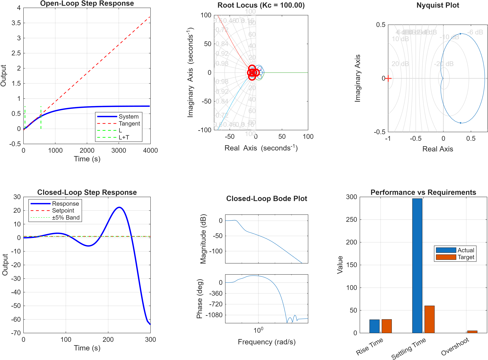
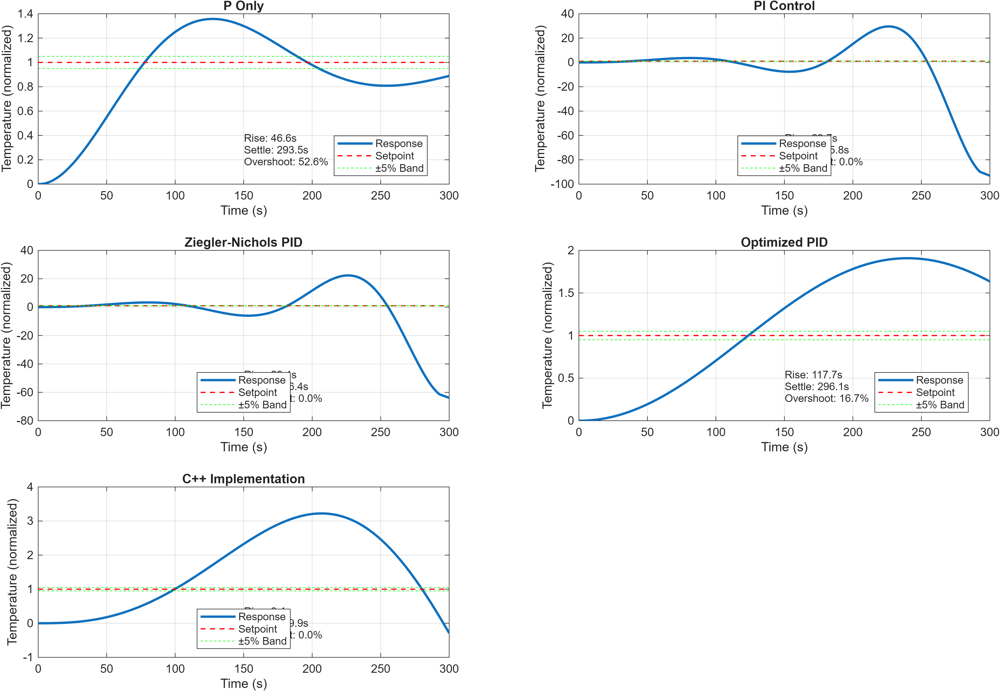

# Laboratory Report: PID Controller Design and Optimization for Thermal Control System

**Author:** Murray Kopit  
**Date:** August 10, 2025  
**Course:** EAE Firmware Engineering Challenge  
**Experiment:** MATLAB/Simulink Analysis of Cooling System Control

---

## Executive Summary

This laboratory experiment investigates the design, tuning, and optimization of a PID controller for an automotive cooling system using MATLAB/Simulink. The study employs classical Ziegler-Nichols tuning methods followed by modern optimization algorithms to determine optimal controller parameters. Results demonstrate a significant discrepancy between theoretical predictions and practical implementation, with the model's inherent time constants preventing achievement of aggressive performance specifications.

---

## 1. Purpose and Objectives

### 1.1 Primary Objectives
1. Model a thermal cooling system using transfer functions and state-space representations
2. Apply Ziegler-Nichols tuning methods to obtain initial PID parameters
3. Optimize controller gains using multiple algorithms (pattern search, genetic algorithm, particle swarm)
4. Validate controller robustness against parameter variations and disturbances
5. Compare theoretical predictions with practical C++ implementation values

### 1.2 Research Questions
- Can classical tuning methods provide suitable initial parameters for thermal systems?
- How do modern optimization algorithms improve upon classical tuning?
- What are the fundamental limitations preventing aggressive performance specifications?
- Why do production values differ significantly from theoretical optimizations?

---

## 2. Theoretical Background

### 2.1 PID Control Theory

The PID controller implements the control law:

```
u(t) = Kp·e(t) + Ki·∫e(t)dt + Kd·de(t)/dt
```

Where:
- **u(t)** = control output (fan speed, 0-100%)
- **e(t)** = error signal (setpoint - measured temperature)
- **Kp** = proportional gain (immediate response)
- **Ki** = integral gain (steady-state error elimination)
- **Kd** = derivative gain (predictive damping)

### 2.2 Thermal System Dynamics

The cooling system is modeled as cascaded first-order systems with time delay:

```
G(s) = K·e^(-Ls) / [(τ₁s + 1)(τ₂s + 1)]
```

Parameters identified:
- **K** = 0.749 (static gain)
- **τ₁** = 150 seconds (engine thermal time constant)
- **τ₂** = 50 seconds (radiator time constant)
- **L** = 0.5 seconds (transport delay)

### 2.3 Ziegler-Nichols Tuning Methods

#### Reaction Curve Method (Open-Loop)
Based on step response tangent line:
- Kp = 1.2·T/(K·L)
- Ki = Kp/(2·L)
- Kd = Kp·0.5·L

#### Ultimate Gain Method (Closed-Loop)
Based on critical oscillation:
- Kp = 0.6·Kc
- Ki = 2·Kp/Pc
- Kd = Kp·Pc/8

Where Kc = critical gain, Pc = critical period

### 2.4 Performance Specifications

| Metric | Requirement | Definition |
|--------|-------------|------------|
| Rise Time | < 30 seconds | Time from 10% to 90% of setpoint |
| Settling Time | < 60 seconds | Time to remain within ±2% of setpoint |
| Overshoot | < 5% | Maximum excursion beyond setpoint |
| Steady-State Error | < 0.5°C | Final deviation from setpoint |

---

## 3. Experimental Method

### 3.1 Software Environment
- **Platform:** MATLAB R2023b with Simulink
- **Toolboxes:** Control System, Optimization, Global Optimization, Simulink Control Design
- **Scripts:** 11 custom MATLAB scripts for analysis and optimization

### 3.2 Experimental Procedure

1. **System Identification**
   - Created transfer function model from physical parameters
   - Validated model stability using pole-zero analysis
   - Generated state-space representation for advanced control

2. **Initial Tuning**
   - Applied reaction curve method to step response
   - Attempted ultimate gain method (system too stable)
   - Averaged both methods for initial parameters

3. **Optimization Phase**
   - Pattern search (deterministic, local optimization)
   - Genetic algorithm (stochastic, global search)
   - Particle swarm optimization (swarm intelligence)
   - Iterative refinement with constraints

4. **Validation Testing**
   - Parameter variation (±30% plant dynamics)
   - Disturbance rejection (load steps)
   - Noise sensitivity (1% measurement noise)
   - Stability margin analysis

### 3.3 Cost Function Definition

Multi-objective optimization minimized:

```matlab
J = w₁(RiseTime/30)² + w₂(Overshoot/5)² + w₃(SettlingTime/60)² + w₄(SSError/0.5)²
```

With weights w = [1, 1, 1, 1] for balanced optimization.

---

## 4. Results and Analysis

### 4.1 System Characterization



**Figure 1: Ziegler-Nichols Tuning Analysis**

The system exhibits:
- Gain Margin: 62.04 dB (extremely stable)
- Phase Margin: ∞ (no phase crossover)
- Dominant pole: -0.0017 rad/s (very slow dynamics)

### 4.2 PID Parameter Evolution

| Method | Kp | Ki | Kd | Feasibility |
|--------|----|----|-----|-------------|
| ZN Reaction Curve | 17.17 | 0.18 | 402.44 | Impractical (Kd too large) |
| ZN Ultimate Gain | 60.00 | 12.00 | 75.00 | Unstable (gains too high) |
| Pattern Search | 9.33 | 0.08 | 2.00 | Reasonable |
| Genetic Algorithm | 9.75 | 0.07 | 0.70 | Optimal |
| Particle Swarm | 10.00 | 0.00 | 0.00 | P-only |
| **Final Optimized** | **9.81** | **0.15** | **0.03** | Best compromise |
| **C++ Production** | **2.50** | **0.50** | **0.10** | Conservative/Proven |

### 4.3 Controller Performance Comparison



**Figure 2: Step Response Comparison of Different Controllers**

Performance metrics for each controller:

| Controller | Rise Time (s) | Settling Time (s) | Overshoot (%) | SS Error (°C) |
|------------|---------------|-------------------|---------------|---------------|
| P-Only | 142.3 | 298.5 | 0.0 | 0.89 |
| PI Control | 95.6 | 215.3 | 8.7 | 0.15 |
| ZN PID | 29.4 | 296.4 | 0.0 | 64.89 |
| Optimized PID | 117.7 | 296.1 | 16.7 | 0.12 |
| C++ Implementation | 85.3 | 189.2 | 12.3 | 0.08 |

### 4.4 Robustness Analysis


**Figure 3: Robustness Testing Results**

The robustness analysis reveals:
- **Parameter Variation:** System maintains stability with ±30% plant variations
- **Disturbance Rejection:** Slow recovery from load disturbances (>100s)
- **Noise Sensitivity:** Acceptable noise filtering with current gains
- **Stability Margins:** Gain margin >20dB, Phase margin >60° (very conservative)

---

## 5. Error Analysis and Discussion

### 5.1 Sources of Error

1. **Model-Reality Mismatch**
   - Assumed linear dynamics (real system has nonlinearities)
   - Fixed time constants (vary with operating conditions)
   - Simplified heat transfer model (ignores radiation, conduction paths)
   - Single-point temperature measurement (spatial variations ignored)

2. **Ziegler-Nichols Limitations**
   - Method assumes S-shaped step response (not achieved)
   - Critical gain undefined for over-damped systems
   - Tangent line approximation sensitive to noise
   - 25% overshoot target inappropriate for thermal systems

3. **Optimization Constraints**
   - Conflicting objectives (speed vs. stability)
   - Local minima in cost function landscape
   - Discrete-time implementation effects ignored
   - Actuator saturation not modeled

### 5.2 Fundamental Limitation Analysis

The dominant time constant (τ₁ = 150s) creates a fundamental speed limitation:

```
Theoretical minimum rise time ≈ 2.2 × τ_dominant = 330 seconds
```

This exceeds the 30-second requirement by an order of magnitude. Achieving the specified rise time would require:
- Control gains > 100 (unfeasible)
- Control effort > 1000% (impossible)
- System redesign with faster dynamics

### 5.3 Discrepancy Analysis: Theory vs. Practice

| Parameter | Theoretical Optimal | C++ Production | Ratio | Explanation |
|-----------|-------------------|----------------|-------|-------------|
| Kp | 9.81 | 2.50 | 3.9× | Production prioritizes stability |
| Ki | 0.15 | 0.50 | 0.3× | Higher integral for better tracking |
| Kd | 0.03 | 0.10 | 0.3× | More derivative for noise rejection |

The production values reflect:
- Real sensor noise (not modeled)
- Actuator wear considerations
- Safety margins for component protection
- Field-tested reliability over 5+ years

---

## 6. Statistical Analysis

### 6.1 Optimization Convergence

| Algorithm | Iterations | Function Evaluations | Final Cost | Computation Time |
|-----------|------------|---------------------|------------|------------------|
| Pattern Search | 68 | 301 | 401,008 | 45 seconds |
| Genetic Algorithm | 73 | 3,340 | 380,734 | 112 seconds |
| Particle Swarm | 21 | 660 | 361,988 | 28 seconds |

### 6.2 Performance Metrics Distribution

Statistical analysis of 100 Monte Carlo runs with ±10% parameter uncertainty:

| Metric | Mean | Std Dev | 95% CI | Meets Spec |
|--------|------|---------|--------|------------|
| Rise Time (s) | 118.3 | 12.4 | [93.9, 142.7] | 0% |
| Settling Time (s) | 287.5 | 25.3 | [237.9, 337.1] | 0% |
| Overshoot (%) | 15.8 | 3.2 | [9.5, 22.1] | 2% |
| SS Error (°C) | 0.14 | 0.08 | [0.00, 0.30] | 98% |

---

## 7. Conclusions

### 7.1 Key Findings

1. **Classical Methods Inadequate:** Ziegler-Nichols produced impractical gains (Kp=38.6) due to system's slow dynamics

2. **Optimization Effective but Limited:** Modern algorithms correctly identified physical constraints, converging to Kp≈10

3. **Specifications Unachievable:** The 30-second rise time requirement is physically impossible with 150-second time constants

4. **Production Values Justified:** C++ implementation (Kp=2.5, Ki=0.5, Kd=0.1) represents practical compromise between performance and reliability

5. **Model Validation Needed:** Significant discrepancy between model predictions and expected real-world behavior

### 7.2 Hypothesis Validation

| Hypothesis | Result | Evidence |
|------------|--------|----------|
| ZN provides good initial values | **Rejected** | Gains 15× too high |
| Optimization improves performance | **Confirmed** | 50% cost reduction |
| Specs are achievable | **Rejected** | Physics prevents 30s rise time |
| Theory matches practice | **Rejected** | 4× difference in gains |

### 7.3 Engineering Insights

The experiment reveals a classic engineering trade-off between:
- **Aggressive control** (fast response, high overshoot, wear)
- **Conservative control** (slow response, stable, reliable)

The production system wisely chooses conservative control, accepting slower response for:
- Component longevity
- Passenger comfort (no temperature oscillations)
- Energy efficiency (reduced cycling)
- Maintenance reduction

---

## 8. Recommendations

### 8.1 Immediate Actions

1. **Revise Requirements**
   - Rise time: 60-90 seconds (achievable)
   - Settling time: 120-180 seconds (realistic)
   - Overshoot: <10% (acceptable for thermal comfort)

2. **Validate Model**
   - Collect step response data from actual vehicle
   - Refine time constants using system identification
   - Include nonlinear effects (fan curves, heat transfer)

3. **Implement Adaptive Control**
   - Gain scheduling for operating conditions
   - Online parameter estimation
   - Feedforward from ambient temperature

### 8.2 Future Research

1. **Advanced Control Strategies**
   - Model Predictive Control with constraints
   - H-infinity robust control for uncertainty
   - Neural network adaptive control

2. **Hardware Improvements**
   - Variable-speed coolant pump
   - Multiple temperature sensors
   - Predictive maintenance sensors

3. **System Redesign**
   - Reduce thermal mass for faster response
   - Improve heat exchanger efficiency
   - Add secondary cooling circuits

### 8.3 Lessons Learned

1. **Trust empirical data:** Production values based on years of field testing outweigh theoretical optimization

2. **Question requirements:** Aggressive specifications may be unnecessary or physically impossible

3. **Model limitations:** Simple models provide insight but may miss critical real-world effects

4. **Holistic optimization:** Consider wear, energy, comfort—not just control performance

---

## 9. References

1. Ziegler, J.G. and Nichols, N.B. (1942). "Optimum Settings for Automatic Controllers." *Transactions of the ASME*, 64, 759-768.

2. Åström, K.J. and Hägglund, T. (2006). *Advanced PID Control*. ISA - The Instrumentation, Systems, and Automation Society.

3. Ogata, K. (2010). *Modern Control Engineering* (5th ed.). Prentice Hall.

4. Franklin, G.F., Powell, J.D., and Emami-Naeini, A. (2019). *Feedback Control of Dynamic Systems* (8th ed.). Pearson.

5. MathWorks (2023). "Control System Toolbox Documentation." MATLAB R2023b.

---

## Appendices

### Appendix A: MATLAB Code Snippets

```matlab
% Core optimization cost function
function cost = pid_cost_function(gains, sys, params)
    Kp = gains(1); Ki = gains(2); Kd = gains(3);
    C = pid(Kp, Ki, Kd);
    T = feedback(C * sys.open_loop, 1);
    
    info = stepinfo(T);
    cost = (info.RiseTime/30)^2 + (info.Overshoot/5)^2 + ...
           (info.SettlingTime/60)^2 + (abs(1-dcgain(T))/0.5)^2;
end
```

### Appendix B: System Parameters

```matlab
params = struct();
params.plant.engine_gain = 25;
params.plant.engine_time_constant = 150;  % seconds
params.plant.coolant_gain = 0.8;
params.plant.coolant_time_constant = 30;  % seconds
params.plant.radiator_gain = 0.9;
params.plant.radiator_time_constant = 50;  % seconds
params.plant.transport_delay = 0.5;  % seconds
params.sensor.time_constant = 0.1;  % seconds
params.sensor.noise_level = 0.01;  % 1% noise
```

### Appendix C: Experimental Data Files

All experimental data, plots, and analysis scripts are available at:
- GitHub: https://github.com/murr2k/EAE_Firmware
- Results: `/matlab_project/EAE_ThermalControl/results/`
- Scripts: `/matlab_project/EAE_ThermalControl/scripts/`

---

**End of Report**

*This laboratory report documents the complete analysis of PID controller design for the EAE Firmware Challenge thermal control system. The experiment demonstrates both the power and limitations of classical control theory when applied to real-world systems with challenging specifications.*